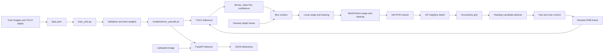

# Embodied AI Project Architecture, Methodology, And Analysis

**Report date:** 2026-09-30
**Evaluation status:** 10-epoch local baseline and 30-epoch Kaggle validation run complete; held-out test evaluation pending.

## Project Summary

This repository is an experimental embodied-perception and active-vision system. It combines object detection, depth-based range estimation, multi-target tracking, spatiotemporal uncertainty estimation, and camera-heading control. It has two simulation paths: a single-drone Genesis bridge and a multi-drone Genesis environment with an optional Gymnasium wrapper. A FastAPI service exposes image-based detection independently of the simulator.

The detector wrapper is named `YOLOv3TinyPerception` for historical reasons, but it uses Ultralytics and the repository's `yolov8n.pt` checkpoint. It is not a YOLOv3 implementation.

## End-to-End Architecture



The FastAPI branch accepts a single RGB image and returns detector output. The Genesis branch also samples the simulated depth image, converts pixel centers into range/bearing measurements, and feeds them into the tracking and heading-control loop.

## Dataset And Training

The prepared dataset is located outside the repository at `C:\Users\ROG\Downloads\yolo_dataset`. Its structure is:

```text
yolo_dataset/
|-- data.yaml
|-- images/
|   |-- train/
|   |-- val/
|   `-- test/
`-- labels/
    |-- train/
    |-- val/
    `-- test/
```

The splits contain 7,003 training images, 2,001 validation images, and 996 test images. Each image has a matching text label file. Labels were checked as YOLO detection rows in the form `class_id x_center y_center width height`, with normalized coordinates and class IDs from 0 through 4.

`data.yaml` points Ultralytics at those split directories. Its current names (`class_0` through `class_4`) are placeholders. Replace them with the real class names while preserving the class ID order before training if detections should have meaningful names.

`train_yolo.py` starts from a YOLO checkpoint, adapts the detection head to the five classes from `data.yaml`, trains at 640 pixels, and exports weights to the configured output path. The maximum is 30 epochs. Recall-aware stopping has a 12-epoch minimum, a six-epoch no-recall-gain patience, a 0.002 minimum recall improvement, and a five-epoch stability window. Train/validation losses must vary by no more than 3% relatively, and validation scores by no more than 0.01 absolutely, over that window. Training and report paths can be directed to Kaggle's writable `/kaggle/working` directory.

**Run status:** The 10-epoch CPU baseline and corrected 30-epoch Kaggle T4 run are complete. The first Kaggle attempt stopped after epoch 1 because Kaggle supplied training losses as a dictionary; the callback was fixed to support dictionary and tensor losses in commit `d533deb`. The corrected run completed all 30 epochs in 0.674 hours, so the recall-aware early-stop condition did not trigger. Its best checkpoint was exported to `/kaggle/working/models/drone_yolov8n_30ep.pt`; the run is under `/kaggle/working/runs/detect/drone_train_30ep-2`. Class names remain placeholders.

## Methodology

### Data preparation

The source data contains 10,000 JPEG images split into 7,003 train, 2,001 validation, and 996 test images. Every image was paired by filename stem with one YOLO `.txt` label file; the pairing check found no unmatched images or labels. Each annotation row has five values: class ID and normalized center-x, center-y, width, and height. There are five IDs, 0–4. The train and validation labels were accepted by Ultralytics. The separate test split has not yet been used for final evaluation.

The dataset has 14,966 annotated objects across all splits. At the 640-pixel letterboxed training scale, median box widths are about 28 pixels; median heights range from about 11 to 19 pixels. Approximately 40% of boxes in each class have both dimensions below 24 pixels. Classes 3 and 4 have the smallest median heights, about 10.9 pixels.

### Model and optimization

Training uses Ultralytics YOLOv8n initialized from the pretrained `yolov8n.pt` checkpoint. Ultralytics replaces its original 80-class detection head with five classes based on `data.yaml`; 319 of 355 checkpoint items transferred in the initial run. The local baseline used 640-pixel images, batch size 8, and AdamW selected by `optimizer=auto`. Kaggle's T4 launch uses batch size 16 by default; lower that to 8 if GPU memory is insufficient.

Validation runs each epoch. The maximum epoch count is 30, but training can stop earlier only when all configured conditions hold: the minimum epoch has been reached, recall has failed to improve by at least 0.002 for six epochs, and train losses, validation losses, and validation scores are stable over the last five epochs. A recall improvement resets the patience counter. The callback writes `early_stopping_metrics.csv`; Ultralytics writes its own results history and plots.

The exported `best.pt` is selected by Ultralytics' fitness criterion, which is primarily mAP-based, not by recall alone. Recall controls the custom stopping condition but does not currently select the exported epoch. If recall is the primary deployment objective, compare checkpoints and confidence thresholds against the validation set before choosing the deployed weights.

### Evaluation protocol

The completed baseline was evaluated on the 2,001-image validation split. Precision/recall and mAP are Ultralytics detection metrics; mAP50 uses an IoU threshold of 0.50, while mAP50–95 averages over IoU thresholds from 0.50 to 0.95. The confusion matrix is a separate fixed operating-point diagnostic: confidence 0.25 and matching IoU 0.45. Its rows are predicted classes, columns are ground-truth classes, and the final row/column represents background. Consequently, its diagonal-recall values are not numerically identical to Ultralytics' reported recall, which is computed through its metric protocol.

## Baseline Results And Analysis

### Learning trend

| Epoch | Validation recall | mAP50 | mAP50–95 | Validation box loss |
|---:|---:|---:|---:|---:|
| 1 | 0.241 | 0.216 | 0.121 | 2.182 |
| 3 | 0.315 | 0.324 | 0.184 | 1.993 |
| 5 | 0.337 | 0.373 | 0.223 | 1.862 |
| 7 | 0.378 | 0.422 | 0.264 | 1.738 |
| 9 | 0.388 | 0.449 | 0.287 | 1.637 |
| 10 | 0.408 | 0.456 | 0.294 | 1.606 |

Across ten epochs, train and validation losses continued to fall and recall rose from 0.241 to 0.408. Recall improved from 0.388 at epoch 9 to 0.408 at epoch 10. This is not evidence of a plateau; extending training is reasonable, but the 30-epoch run must determine whether those gains continue.

### 30-epoch Kaggle result

The corrected T4 run completed the full 30 epochs. Its final best-checkpoint validation output reported precision 0.824, recall 0.479, mAP50 0.531, and mAP50–95 0.373. A second validation pass on the exported checkpoint reported 0.827, 0.480, 0.532, and 0.375 respectively. The small differences are consistent with normal evaluation/runtime variation; the exported-checkpoint pass is used for the per-class comparison below.

Compared with the 10-epoch CPU baseline, exported-checkpoint validation improved precision by 0.049, recall by 0.072, mAP50 by 0.076, and mAP50–95 by 0.081. Recall rose from 0.408 to 0.480, a 17.6% relative increase. Training longer helped materially, though recall remains below 0.5.

### Per-class validation metrics

| Class | Instances | Precision | Recall | mAP50 | mAP50–95 |
|---|---:|---:|---:|---:|---:|
| class_0 | 607 | 0.821 | 0.519 | 0.581 | 0.398 |
| class_1 | 583 | 0.850 | 0.540 | 0.586 | 0.437 |
| class_2 | 607 | 0.773 | 0.364 | 0.417 | 0.247 |
| class_3 | 593 | 0.714 | 0.293 | 0.336 | 0.187 |
| class_4 | 629 | 0.736 | 0.320 | 0.361 | 0.203 |

### Exported 30-epoch checkpoint, per-class validation metrics

| Class | Instances | Precision | Recall | mAP50 | mAP50–95 | Recall gain vs. baseline |
|---|---:|---:|---:|---:|---:|---:|
| class_0 | 607 | 0.927 | 0.590 | 0.657 | 0.485 | +0.071 |
| class_1 | 583 | 0.878 | 0.595 | 0.645 | 0.513 | +0.055 |
| class_2 | 607 | 0.830 | 0.442 | 0.497 | 0.338 | +0.078 |
| class_3 | 593 | 0.781 | 0.373 | 0.425 | 0.260 | +0.080 |
| class_4 | 629 | 0.719 | 0.401 | 0.436 | 0.278 | +0.081 |

Recall improved for all five classes. Classes 2–4 made the largest absolute gains (about 0.078–0.081), supporting the hypothesis that the original short run undertrained the detector. However, classes 3 and 4 remain the lowest-recall classes at 0.373 and 0.401, and class_4 precision is lower than its baseline value. Their small median box heights remain a plausible additional difficulty.

### Confusion-matrix findings

| Ground-truth class | Objects | Correct detections | Missed as background | Assigned wrong class | Matrix recall |
|---|---:|---:|---:|---:|---:|
| class_0 | 607 | 302 | 289 | 16 | 0.498 |
| class_1 | 583 | 304 | 264 | 15 | 0.521 |
| class_2 | 607 | 209 | 384 | 14 | 0.344 |
| class_3 | 593 | 164 | 420 | 9 | 0.277 |
| class_4 | 629 | 182 | 423 | 24 | 0.289 |

For the **10-epoch baseline** only, 3,019 validation objects produced 1,780 (59.0%) background misses, 78 (2.6%) cross-class assignments, and 1,161 correct matches at the confusion-matrix operating point. This baseline matrix indicates misses, not class swaps, were dominant. It must not be treated as the 30-epoch model's error count. The new 30-epoch confusion matrix and class-recall report were generated under `/kaggle/working/runs/detect/drone_train_30ep_analysis`; their numeric contents were not included in the shared console screenshot. Compare those CSVs before claiming how the miss rate changed. Class support is balanced, so class-count imbalance alone does not explain the weak recall.

The model's precision is materially higher than its recall. This is consistent with detections being conservative at the selected confidence threshold, but threshold changes trade precision for recall and must be compared on validation data. The confusion matrix also contains 162 unmatched predicted boxes; lowering confidence may recover true objects while increasing this false-positive count.

### Root-cause assessment

1. **Small objects are the strongest measured clue.** At 640-pixel input, many objects occupy only a small number of vertical pixels; classes 3 and 4 are especially short. Downsampling can erase their distinguishing shape and make localization harder.
2. **Misses dominate class mistakes.** The background row's 1,780 missed objects far exceeds 78 cross-class assignments. This points toward object visibility/localization/confidence acceptance, rather than class semantics, as the first area to investigate.
3. **Class imbalance is not supported by the counts.** Validation support ranges from 583 to 629 instances. Avoid class weighting as the first intervention; it is unlikely to address the measured dominant failure.
4. **Label quality and scene difficulty remain unverified.** Blur, occlusion, crowded boxes, inconsistent annotation, and object truncation could contribute. The confusion matrix cannot identify which factor caused a particular miss; inspect false-negative image examples and labels.
5. **The 10-epoch run was still improving.** The available curve does not show recall stagnation at epoch 10. A longer run is justified, but not guaranteed to solve the small-object limitation.

### Recommended experiments

1. Inspect the new 30-epoch `confusion_matrix.csv`, `class_recall_metrics.csv`, and `recall_analysis.txt` to quantify whether the baseline's 59% miss rate fell and which classes still contribute most false negatives.
2. Run a controlled higher-resolution comparison (for example 960 pixels with a reduced batch) using the same split and starting checkpoint. Compare class_3/class_4 recall and false positives; keep the validation protocol fixed.
3. Sweep inference confidence on the validation set and choose an operating point based on the required recall/precision tradeoff. Do not tune on the test split.
4. Review sampled false negatives, especially classes 3 and 4, checking label coverage, box tightness, object visibility, and image compression/blur.
5. After selecting settings, evaluate the held-out test split once and record its metrics separately from validation results.

## Perception And Detection

`yolov3_backbone.py` provides `YOLOv3TinyPerception`:

- Loads an Ultralytics model checkpoint and warms it up.
- Accepts RGB frames, converts float RGB in `[0, 1]` to the model's expected 8-bit input, and prepares a tensor for inference.
- Returns pixel-space `xyxy` bounding boxes, class IDs/names, confidence scores, and box centers.
- For RGB-D input, samples valid depth values in a small patch around each box center. It uses the median depth and a pinhole approximation from the configured horizontal field of view to produce local `[range, bearing]` measurements.
- Supports direct image inference from its command-line entry point.

The geometric conversion assumes RGB and depth are aligned and that depth values are usable as metric distances. The simulator's actual camera calibration and depth units still need end-to-end validation against known targets.

## Simulation And Tracking

### Single-drone Genesis bridge

`genesis_bridge.py` builds a CF2X drone, plane, and 640 x 480 camera. It loads `models/drone_yolov8n.pt` by default (or the path in `YOLO_MODEL_PATH`) and fails before simulator initialization if that checkpoint is missing. A caller can alternatively provide a custom `measurement_provider` or detector.

At the configured control interval, the bridge renders RGB and depth, runs YOLO, converts local measurements to world-frame polar measurements, predicts and updates the tracker, updates the GP belief from the strongest tracked component, computes the uncertainty grid, and selects a heading. A proportional yaw controller applies the heading target through the drone propellers. The optional camera preview exits on `Q`, `Esc`, or window close.

### GM-PHD-style tracker

`GMHPHDtracker.py` stores Gaussian components with a 4D state `[x, y, v_x, v_y]`, covariance, and weight. Prediction uses a constant-velocity transition and process noise, with ego velocity included in the position prediction. The observation model is polar `[range, bearing]`; the measurement update uses an EKF Jacobian and Joseph-form covariance update. Unmatched observations create new components, then low-weight components are pruned, nearby components merged, and the mixture capped.

This is a simplified prototype rather than a complete production multi-object PHD implementation. In particular, component/measurement association and weights are intentionally lightweight.

### GP belief, uncertainty, and heading selection

`GPNeighborBelief.py` records labeled position/time samples and predicts a mean and standard deviation with a Matérn 3/2 kernel. Old observations are removed using a temporal window. `UncertaintyQuantifier` queries GP uncertainty on a 2D grid and applies a 90-degree field-of-view cone and maximum range. The planner in `tsp_alg.py` scores a discrete set of candidate headings by summing uncertainty in the visible region, preferring the current heading on ties.

Despite its module name, `TSPHeadingPlanner` is a local discrete heading search, not a traveling-salesperson route solver.

### Multi-drone environment and RL wrapper

`swarmmanager.py` builds a multi-drone Genesis environment with a per-drone detector, tracker, GP belief, uncertainty grid, and heading planner. Its default camera resolution is 640 x 480 to reduce rendering and inference load; callers can override `camera_resolution`. The same configured resolution is passed to the detector. `ActiveVisionWrapper.py` exposes observations containing per-drone uncertainty and mean grids, plus a Gymnasium-style action and reward interface.

This path is separate from the single-drone bridge. The environment currently creates detectors with the wrapper's default `yolov8n.pt` checkpoint rather than automatically selecting the custom checkpoint. Also, `ActiveVisionRLWrapper.step(actions)` currently uses the actions to calculate a control-cost term in the reward but does not pass them to the environment or apply them to drone control. Treat this RL interface as a scaffold, not a completed action-controlled training environment.

## API

`api_server.py` provides a FastAPI service:

- `GET /health` reports whether the detector has loaded.
- `GET /model` reports checkpoint, input resolution, and class names.
- `POST /detect` accepts an image upload and optional confidence threshold, then returns image dimensions and a list of detections as JSON.

The API prefers `models/drone_yolov8n.pt` when present. Otherwise it falls back to the repository's `yolov8n.pt` base checkpoint. That fallback is a general pretrained model, not the custom dataset-trained detector. `YOLO_MODEL_PATH` overrides either default.

## Camera Geometry Utilities

`distortion_correction.py` provides radial polynomial correction, camera-ray unit vectors, and a `MonocularLocator` compatibility wrapper that estimates distance from the known physical radius of an object. `bounding_box.py` contains an earlier standalone version of similar monocular geometry. These utilities are not currently wired into the YOLO RGB-D bridge, which uses the simulator's depth map instead.

## Source File Map

| File | Responsibility |
|---|---|
| `train_yolo.py` | Custom YOLO training entry point and best-checkpoint export. |
| `download_kaggle_model.py` | Downloads a published Kaggle checkpoint into the local `models/` directory. |
| `yolov3_backbone.py` | Ultralytics model wrapper, bounding-box inference, RGB-D projection, and single-image CLI. |
| `api_server.py` | FastAPI health, model information, and image-detection endpoints. |
| `genesis_bridge.py` | Single-drone Genesis simulation connected to YOLO, tracking, uncertainty, and heading control. |
| `swarmmanager.py` | Multi-drone Genesis environment with independent perception/tracking/planning pipelines. |
| `ActiveVisionWrapper.py` | Optional Gymnasium-style wrapper around the multi-drone environment. |
| `GMHPHDtracker.py` | Gaussian-mixture tracking and measurement updates. |
| `GPNeighborBelief.py` | Spatiotemporal GP belief and uncertainty-grid generation. |
| `tsp_alg.py` | Candidate heading search over the uncertainty grid. |
| `distortion_correction.py` | Camera radial distortion correction and monocular geometry. |
| `bounding_box.py` | Earlier bounding-box and monocular distance helper. |
| `Mockgp.py` | Standalone uncertainty-grid checks using a mock GP. |
| `test_distortion_correction.py` | Camera geometry unit tests. |
| `test_gmphdtracker.py` | Tracker update, merging, and input-validation tests. |
| `test_tsp_alg.py` | Heading planner and uncertainty-grid integration tests. |
| `requirements-api.txt` | FastAPI server dependencies. |
| `requirements-yolo.txt` | Ultralytics, NumPy, and OpenCV detector dependencies. |
| `yolov8n.pt` | Pretrained base checkpoint used to initialize custom training and API fallback. |

## Run Commands

Run these commands from the repository root with the project virtual environment active.

### Train the custom detector

After replacing placeholder class names in `C:\Users\ROG\Downloads\yolo_dataset\data.yaml`:

```powershell
python -m pip install -r requirements-yolo.txt
python train_yolo.py --epochs 30 --imgsz 640 --batch 8 --device auto
```

For Kaggle T4, after preparing `/kaggle/working/yolo_data.yaml` and cloning the latest repository, run:

```bash
python train_yolo.py --data /kaggle/working/yolo_data.yaml --model /kaggle/input/<project-input>/models/drone_yolov8n.pt --epochs 30 --min-epochs 12 --recall-patience 6 --stability-window 5 --recall-min-delta 0.002 --imgsz 640 --batch 16 --device 0 --workers 2 --project /kaggle/working/runs/detect --output-model /kaggle/working/models/drone_yolov8n_30ep.pt --name drone_train_30ep
```

Use the actual attached checkpoint path for `--model`; omit that option to start from the cloned project's `yolov8n.pt`. The best local checkpoint is `models/drone_yolov8n.pt`. Kaggle training outputs and confusion reports are saved under `/kaggle/working`.

### Import the Kaggle checkpoint into this repository

The Kaggle notebook cannot write directly to this local Windows workspace. To copy the published T4 checkpoint into this project's `models/` folder, configure KaggleHub authentication locally and run:

```powershell
python -m pip install kagglehub
python download_kaggle_model.py
```

The default Kaggle model handle is `dark77/active-vision-model/pytorch/default`. The script downloads the latest version to `models/drone_yolov8n_30ep.pt` and leaves `models/drone_yolov8n.pt` untouched. Use `--handle` or `--output` to override the defaults. Set `YOLO_MODEL_PATH` to the imported file when starting the API or simulator.

### Detect one image

```powershell
python yolov3_backbone.py "C:\path\to\image.jpg" --model "models\drone_yolov8n.pt"
```

### Start the detection API

```powershell
python -m pip install -r requirements-api.txt -r requirements-yolo.txt
python -m uvicorn api_server:app --host 127.0.0.1 --port 8000
```

Open `http://127.0.0.1:8000/docs` for interactive API requests.

### Start the single-drone simulator

This requires the trained checkpoint and Genesis World:

```powershell
python -m pip install genesis-world
python genesis_bridge.py
```

For a different checkpoint, set `YOLO_MODEL_PATH` before starting the process. The simulator's Genesis backend defaults to CPU in `genesis_bridge.py`.

## Verification And Current Gaps

- The prepared dataset YAML was accepted by Ultralytics, and all image/label basenames matched across the three splits.
- The repository's 13 discoverable `unittest` tests pass.
- A focused smoke check verified RGB-D projection of a centered detection to the expected range/bearing output.
- The 10-epoch custom YOLO training job completed on CPU; the trained checkpoint loads and produces detections on a validation image.
- The corrected 30-epoch Kaggle T4 run completed in 0.674 hours; its output and exported checkpoint were reported by the notebook.
- The new 30-epoch confusion report was generated, but its numeric CSV contents have not yet been reviewed here; the confusion counts quoted above are only for the 10-epoch baseline.
- A full Genesis visual simulation and evaluation on the held-out test split have not been run yet.
- The real semantic class names, RGB/depth metric calibration, multi-drone RL action path, and full closed-loop simulator behavior remain to be confirmed or completed.