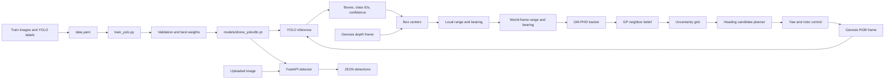

# Embodied AI Project Architecture

## Project Summary

This repository is an experimental embodied-perception and active-vision system. It combines object detection, depth-based range estimation, multi-target tracking, spatiotemporal uncertainty estimation, and camera-heading control. It has two simulation paths: a single-drone Genesis bridge and a multi-drone Genesis environment with an optional Gymnasium wrapper. A FastAPI service exposes image-based detection independently of the simulator.

The detector wrapper is named `YOLOv3TinyPerception` for historical reasons, but it uses Ultralytics and the repository's `yolov8n.pt` checkpoint. It is not a YOLOv3 implementation.

## End-to-End Architecture



The FastAPI branch accepts a single RGB image and returns detector output. The Genesis branch also samples the simulated depth image, converts pixel centers into range/bearing measurements, and feeds them into the tracking and heading-control loop.

## Dataset And Training

The prepared dataset is located outside the repository at `C:\Users\ROG\Downloads\yolo_dataset`. Its structure is:

```text
yolo_dataset/
|-- data.yaml
|-- images/
|   |-- train/
|   |-- val/
|   `-- test/
`-- labels/
    |-- train/
    |-- val/
    `-- test/
```

The splits contain 7,003 training images, 2,001 validation images, and 996 test images. Each image has a matching text label file. Labels were checked as YOLO detection rows in the form `class_id x_center y_center width height`, with normalized coordinates and class IDs from 0 through 4.

`data.yaml` points Ultralytics at those split directories. Its current names (`class_0` through `class_4`) are placeholders. Replace them with the real class names while preserving the class ID order before training if detections should have meaningful names.

`train_yolo.py` starts from the local `yolov8n.pt` weights by default, trains using the dataset config, and copies the best checkpoint to `models/drone_yolov8n.pt`. The maximum is now 30 epochs at 640 pixels and batch size 8. Custom stopping starts after epoch 12 and requires both six epochs without a recall gain of 0.002 and five recent stable epochs across training losses, validation losses, and validation scores. `--project` and `--output-model` let Kaggle runs write persistent outputs under `/kaggle/working`.

**Training status:** The existing checkpoint is the 10-epoch CPU baseline. On the 2,001-image validation split, it reached precision 0.778, recall 0.408, mAP50 0.456, and mAP50-95 0.294. The 30-epoch recall-aware run has not been started. The class names remain placeholders; replace them with the dataset's real names before presenting predictions to users.

The baseline confusion matrix is oriented with predicted classes in rows, ground-truth classes in columns, and background as the final row/column. At its 0.25 confidence and 0.45 matching-IoU operating point, it records 1,780 background misses out of 3,019 ground-truth objects (59.0%), versus 78 cross-class assignments (2.6%). Class counts are balanced (583–629 objects each), but matrix recall is lowest for class_3 (0.277) and class_4 (0.289). This points primarily to missed/localization-limited detections rather than confusion between the five classes. Small, blurred, occluded objects, annotation coverage, and confidence threshold are likely areas to inspect; the matrix alone does not prove which one is the cause.

Training and analysis produce `early_stopping_metrics.csv`, `confusion_matrix.csv`, `class_recall_metrics.csv`, and `recall_analysis.txt` in addition to Ultralytics' confusion-matrix and metric plots. Pass `--analyze-only --model <checkpoint>` to generate the confusion report without training.

## Perception And Detection

`yolov3_backbone.py` provides `YOLOv3TinyPerception`:

- Loads an Ultralytics model checkpoint and warms it up.
- Accepts RGB frames, converts float RGB in `[0, 1]` to the model's expected 8-bit input, and prepares a tensor for inference.
- Returns pixel-space `xyxy` bounding boxes, class IDs/names, confidence scores, and box centers.
- For RGB-D input, samples valid depth values in a small patch around each box center. It uses the median depth and a pinhole approximation from the configured horizontal field of view to produce local `[range, bearing]` measurements.
- Supports direct image inference from its command-line entry point.

The geometric conversion assumes RGB and depth are aligned and that depth values are usable as metric distances. The simulator's actual camera calibration and depth units still need end-to-end validation against known targets.

## Simulation And Tracking

### Single-drone Genesis bridge

`genesis_bridge.py` builds a CF2X drone, plane, and 640 x 480 camera. It loads `models/drone_yolov8n.pt` by default (or the path in `YOLO_MODEL_PATH`) and fails before simulator initialization if that checkpoint is missing. A caller can alternatively provide a custom `measurement_provider` or detector.

At the configured control interval, the bridge renders RGB and depth, runs YOLO, converts local measurements to world-frame polar measurements, predicts and updates the tracker, updates the GP belief from the strongest tracked component, computes the uncertainty grid, and selects a heading. A proportional yaw controller applies the heading target through the drone propellers. The optional camera preview exits on `Q`, `Esc`, or window close.

### GM-PHD-style tracker

`GMHPHDtracker.py` stores Gaussian components with a 4D state `[x, y, v_x, v_y]`, covariance, and weight. Prediction uses a constant-velocity transition and process noise, with ego velocity included in the position prediction. The observation model is polar `[range, bearing]`; the measurement update uses an EKF Jacobian and Joseph-form covariance update. Unmatched observations create new components, then low-weight components are pruned, nearby components merged, and the mixture capped.

This is a simplified prototype rather than a complete production multi-object PHD implementation. In particular, component/measurement association and weights are intentionally lightweight.

### GP belief, uncertainty, and heading selection

`GPNeighborBelief.py` records labeled position/time samples and predicts a mean and standard deviation with a Matérn 3/2 kernel. Old observations are removed using a temporal window. `UncertaintyQuantifier` queries GP uncertainty on a 2D grid and applies a 90-degree field-of-view cone and maximum range. The planner in `tsp_alg.py` scores a discrete set of candidate headings by summing uncertainty in the visible region, preferring the current heading on ties.

Despite its module name, `TSPHeadingPlanner` is a local discrete heading search, not a traveling-salesperson route solver.

### Multi-drone environment and RL wrapper

`swarmmanager.py` builds a multi-drone Genesis environment with a per-drone detector, tracker, GP belief, uncertainty grid, and heading planner. Its default camera resolution is 640 x 480 to reduce rendering and inference load; callers can override `camera_resolution`. The same configured resolution is passed to the detector. `ActiveVisionWrapper.py` exposes observations containing per-drone uncertainty and mean grids, plus a Gymnasium-style action and reward interface.

This path is separate from the single-drone bridge. The environment currently creates detectors with the wrapper's default `yolov8n.pt` checkpoint rather than automatically selecting the custom checkpoint. Also, `ActiveVisionRLWrapper.step(actions)` currently uses the actions to calculate a control-cost term in the reward but does not pass them to the environment or apply them to drone control. Treat this RL interface as a scaffold, not a completed action-controlled training environment.

## API

`api_server.py` provides a FastAPI service:

- `GET /health` reports whether the detector has loaded.
- `GET /model` reports checkpoint, input resolution, and class names.
- `POST /detect` accepts an image upload and optional confidence threshold, then returns image dimensions and a list of detections as JSON.

The API prefers `models/drone_yolov8n.pt` when present. Otherwise it falls back to the repository's `yolov8n.pt` base checkpoint. That fallback is a general pretrained model, not the custom dataset-trained detector. `YOLO_MODEL_PATH` overrides either default.

## Camera Geometry Utilities

`distortion_correction.py` provides radial polynomial correction, camera-ray unit vectors, and a `MonocularLocator` compatibility wrapper that estimates distance from the known physical radius of an object. `bounding_box.py` contains an earlier standalone version of similar monocular geometry. These utilities are not currently wired into the YOLO RGB-D bridge, which uses the simulator's depth map instead.

## Source File Map

| File | Responsibility |
|---|---|
| `train_yolo.py` | Custom YOLO training entry point and best-checkpoint export. |
| `yolov3_backbone.py` | Ultralytics model wrapper, bounding-box inference, RGB-D projection, and single-image CLI. |
| `api_server.py` | FastAPI health, model information, and image-detection endpoints. |
| `genesis_bridge.py` | Single-drone Genesis simulation connected to YOLO, tracking, uncertainty, and heading control. |
| `swarmmanager.py` | Multi-drone Genesis environment with independent perception/tracking/planning pipelines. |
| `ActiveVisionWrapper.py` | Optional Gymnasium-style wrapper around the multi-drone environment. |
| `GMHPHDtracker.py` | Gaussian-mixture tracking and measurement updates. |
| `GPNeighborBelief.py` | Spatiotemporal GP belief and uncertainty-grid generation. |
| `tsp_alg.py` | Candidate heading search over the uncertainty grid. |
| `distortion_correction.py` | Camera radial distortion correction and monocular geometry. |
| `bounding_box.py` | Earlier bounding-box and monocular distance helper. |
| `Mockgp.py` | Standalone uncertainty-grid checks using a mock GP. |
| `test_distortion_correction.py` | Camera geometry unit tests. |
| `test_gmphdtracker.py` | Tracker update, merging, and input-validation tests. |
| `test_tsp_alg.py` | Heading planner and uncertainty-grid integration tests. |
| `requirements-api.txt` | FastAPI server dependencies. |
| `requirements-yolo.txt` | Ultralytics, NumPy, and OpenCV detector dependencies. |
| `yolov8n.pt` | Pretrained base checkpoint used to initialize custom training and API fallback. |

## Run Commands

Run these commands from the repository root with the project virtual environment active.

### Train the custom detector

After replacing placeholder class names in `C:\Users\ROG\Downloads\yolo_dataset\data.yaml`:

```powershell
python -m pip install -r requirements-yolo.txt
python train_yolo.py --epochs 10 --imgsz 640 --batch 8 --device auto
```

The resulting best checkpoint is `models/drone_yolov8n.pt`.

### Detect one image

```powershell
python yolov3_backbone.py "C:\path\to\image.jpg" --model "models\drone_yolov8n.pt"
```

### Start the detection API

```powershell
python -m pip install -r requirements-api.txt -r requirements-yolo.txt
python -m uvicorn api_server:app --host 127.0.0.1 --port 8000
```

Open `http://127.0.0.1:8000/docs` for interactive API requests.

### Start the single-drone simulator

This requires the trained checkpoint and Genesis World:

```powershell
python -m pip install genesis-world
python genesis_bridge.py
```

For a different checkpoint, set `YOLO_MODEL_PATH` before starting the process. The simulator's Genesis backend defaults to CPU in `genesis_bridge.py`.

## Verification And Current Gaps

- The prepared dataset YAML was accepted by Ultralytics, and all image/label basenames matched across the three splits.
- The repository's 13 discoverable `unittest` tests pass.
- A focused smoke check verified RGB-D projection of a centered detection to the expected range/bearing output.
- The 10-epoch custom YOLO training job completed on CPU; the trained checkpoint loads and produces detections on a validation image.
- A full Genesis visual simulation and evaluation on the held-out test split have not been run yet.
- The real semantic class names, RGB/depth metric calibration, multi-drone RL action path, and full closed-loop simulator behavior remain to be confirmed or completed.