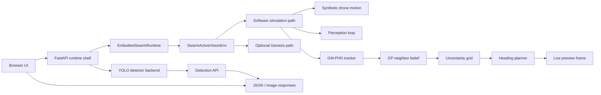

# Embodied AI Runtime

This repository is an embodied-perception and swarm-simulation project that runs in two modes:

- a software-first runtime for local simulation and browser preview
- an optional Genesis-based simulation path when a compatible runtime is available

The current project is organized as a single runtime shell that keeps the simulation and detection layers in one app, while still exposing the detector API and the browser dashboard.

## What this project does

The system combines:

- a YOLO-based detector for perception
- a tracking and uncertainty loop for belief updates
- a swarm planning loop for heading selection and control
- a live web dashboard for previewing the simulation
- an optional Genesis host for higher-fidelity visual simulation

The important design choice is that the simulator is not treated as a separate product. The app is built as one runtime environment, where perception can be used as a sensor input while the world simulation remains the primary execution path.

## Architecture overview



## Runtime structure

### 1. App shell: embodied_app.py
This file is the main FastAPI application and the main entry point for the live project.

Responsibilities:
- serves the UI from the static dashboard
- exposes the health, model, detection, and simulation API routes
- creates a single runtime object shared across endpoints
- provides a software-safe simulation path when Genesis is absent or failing

Key routes:
- GET /health
- GET /model
- POST /detect
- POST /simulation/start
- GET /simulation/view
- GET /simulation/preview

The app intentionally keeps the detector and simulation in one runtime instead of splitting them into separate standalone systems.

### 2. Runtime core: swarmmanager.py
This is the simulation engine used by the main runtime.

Responsibilities:
- create drone agents and world state
- update each agent's heading and motion
- maintain per-agent perception and planning state
- generate a live preview image
- switch between software simulation and Genesis-backed simulation cleanly

Main classes:
- SyntheticSoftwarePerception
  - lightweight synthetic sensor used when the project is running without a real model or visual host
- SwarmActiveVisionEnv
  - the environment class that manages drone state, motion, and the update loop
  - uses the software path by default in headless environments
- EmbodiedSwarmRuntime
  - wrapper used by the API to create and run the simulation

### 3. Perception layer: yolov3_backbone.py
This module wraps the detector model used by the app.

Responsibilities:
- resolve the model checkpoint path
- load Ultralytics YOLO
- process an RGB image into detections
- convert image-space detections into measurement values
- support both detector API use and simulator perception use

Main symbol:
- YOLOv3TinyPerception

Even though the class name is historical, it is the active detector layer used by the current project.

### 4. Tracking layer: GMHPHDtracker.py
This is the belief-tracking subsystem.

Responsibilities:
- maintain Gaussian components for tracked entities
- perform prediction and measurement update
- prune weak components and merge overlap
- keep a compact mixture approximation of the swarm belief

This is the core state-estimation loop inside the embedded world runtime.

### 5. Spatial belief and uncertainty: GPNeighborBelief.py
This module creates the spatiotemporal belief model.

Responsibilities:
- keep recent observed samples
- estimate a belief surface over space and time
- compute uncertainty over a grid
- provide the uncertainty signal used by the planner

Important components:
- GPNeighborBelief
- UncertaintyQuantifier

The planner uses this uncertainty to decide where the agent should look next.

### 6. Planning layer: tsp_alg.py
This file contains the heading planner.

Responsibilities:
- sample candidate headings
- score each heading by uncertainty in the visible region
- choose the heading with the highest reward
- keep heading changes smooth and stable

Main symbol:
- TSPHeadingPlanner

Although the name is legacy, its purpose in the current system is local uncertainty-driven heading selection, not a traveling-salesperson optimizer.

### 7. Browser UI: static/index.html
This is the front-end dashboard shown in the browser.

Responsibilities:
- render the simulation preview and control panel
- show live runtime metrics
- allow the user to trigger the swarm run and refresh the preview
- present the detector dashboard and model information alongside the simulation view

The UI is designed to support the embodied runtime in a browser-first workflow, which is especially useful in a headless Windows environment.

### 8. Optional Genesis backend: genesis_bridge.py
Genesis remains an optional simulation backend, not the required runtime path.

Responsibilities:
- create a higher-fidelity scene when Genesis is installed and usable
- render the agent and camera world
- connect perception, tracking, and planning to the simulated environment

In the current project, the software simulation is preferred because it remains stable in local headless environments.

### 9. Training and model pipeline
The repo also contains the training and checkpoint support files:

- train_yolo.py
  - trains the custom detector
- download_kaggle_model.py
  - downloads a published model checkpoint
- requirements-yolo.txt
  - dependencies for training and inference
- requirements-api.txt
  - dependencies for the FastAPI runtime

This means the system supports both the model-training workflow and the live runtime workflow.

## Data flow

1. The browser sends commands to the FastAPI runtime.
2. The runtime initializes the simulation environment.
3. The environment updates drone state and synthetic camera frames.
4. The perception system extracts measurements or detections.
5. The tracker updates the current belief state.
6. Uncertainty is mapped over the world grid.
7. The planner selects the next heading.
8. The latest frame is returned to the browser preview.

The project is built to follow an embodied loop:

- perception
- belief update
- uncertainty estimation
- planning
- control
- visualization

## Start the app locally

From the project root:

```powershell
Set-ExecutionPolicy -Scope Process -ExecutionPolicy RemoteSigned
.\.venv\Scripts\Activate.ps1
python -m uvicorn embodied_app:app --host 127.0.0.1 --port 8014
```

Then open:

- http://127.0.0.1:8014/
- http://127.0.0.1:8014/docs

## Current runtime behavior

The stable runtime path now is:

- software simulation enabled by default
- no forced Genesis initialization in the main app flow
- browser view generated from the live simulation state
- detection API kept available as a feature, not the main runtime target

This is the correct architecture for a software-first embodied system running in a local headless environment.

## Repository contents

Key files in the project:

- embodied_app.py — main app shell
- swarmmanager.py — swarm environment and runtime
- yolov3_backbone.py — detector backend
- GMHPHDtracker.py — tracking
- GPNeighborBelief.py — GP belief and uncertainty
- tsp_alg.py — heading planner
- static/index.html — browser UI
- genesis_bridge.py — optional Genesis support
- train_yolo.py — training pipeline
- api_server.py — earlier API implementation and detection server
- PROJECT_ARCHITECTURE.md — deeper design notes

## Notes

This project is designed as an experimental embodied AI runtime and not as a fixed hardware-only drone stack. The simulation-first path is deliberately intended to be runnable before hardware or model integration is connected.
