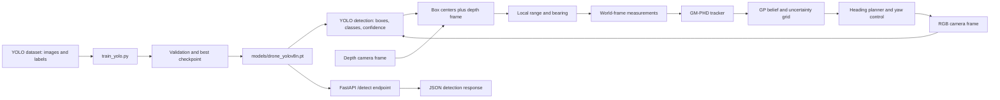

# Active Vision Model

This repository contains a lightweight active-vision and tracking prototype built around camera distortion correction and a Gaussian Mixture Probability Hypothesis Density (GM-PHD) tracker.

## Project Overview

The project combines camera geometry, multi-target tracking, and active-view planning:

1. Camera calibration and distortion correction for image geometry.
2. Multi-target tracking using a simplified Gaussian-mixture PHD approach in polar coordinates.
3. Spatiotemporal neighbor beliefs and uncertainty-guided heading selection.

The overall workflow is:

- the camera model corrects projected image coordinates,
- the tracker predicts target motion in a 4D state space,
- measurements are converted from Cartesian to polar form,
- an extended Kalman filter updates each Gaussian component,
- weak/duplicate components are pruned and merged to keep the mixture manageable,
- the uncertainty model builds a grid, and a heading planner selects a candidate field of view with high remaining uncertainty.

## Architecture

### 1. Distortion Correction
The distortion helper code is intended to model camera lens distortion and recover corrected image coordinates. This is useful when working with real sensors that introduce radial or tangential distortion errors.

Core idea:

- estimate the camera intrinsics,
- project points through the distortion model,
- undo the distortion so downstream tracking uses physically consistent coordinates.

### 2. Bounding Box Utilities
The bounding-box logic is typically used to convert pixel-space detections into trackable observations or regions of interest. In active-vision systems, bounding boxes often serve as input for object association, filtering, or motion estimation.

### 3. GM-PHD Tracking
The file `GMHPHDtracker.py` implements a simplified Gaussian-mixture PHD tracker.

The tracker maintains a list of Gaussian components, each containing:

- `mean`: the 4D state estimate for position and velocity,
- `cov`: the state covariance,
- `weight`: the component weight used for pruning and mixture management.

The main stages are:

#### Prediction
The state transition matrix advances each Gaussian forward in time and adds process noise. This step models target motion between sensor updates.

#### Measurement update
Measurements in polar coordinates are converted to the expected observation model using a Jacobian-based EKF update. The residual is computed between the actual measurement and the predicted measurement, then used to update the mean and covariance.

#### Birth of new components
Unmatched measurements are initialized as new Gaussian components with larger uncertainty so they can be absorbed as newly observed targets.

#### Pruning and merging
The tracker removes weak components and merges nearby ones to keep the number of Gaussians bounded and avoid exponential growth.

### 4. Neighbor Beliefs and Uncertainty
`GPNeighborBelief.py` provides a spatiotemporal Gaussian-process belief using a Matérn 3/2 kernel. `GPNeighborBelief` stores labeled observations and predicts a mean and uncertainty at a queried position and time.

`UncertaintyQuantifier` creates a 2D coordinate grid and computes an uncertainty matrix from a list of GP-like objects. Its inputs implement `prune_old_data(t_now)` and `predict(x, y, t_now)`. The field-of-view mask uses a 90-degree cone and the configured sensor range.

### 5. Heading Selection
`tsp_alg.py` contains `TSPHeadingPlanner`. Despite the module name, this is a discrete heading search, not a traveling-salesperson route optimizer. It scores candidate headings by summing uncertainty values inside the corresponding field of view and returns the selected heading and score. It accepts the uncertainty matrix and coordinate grids produced by `UncertaintyQuantifier`.

Example:

```python
from GPNeighborBelief import UncertaintyQuantifier
from tsp_alg import TSPHeadingPlanner

quantifier = UncertaintyQuantifier(max_fov_range=8.0)
uncertainty = quantifier.compute_UNC_matrix(gp_models, uav_heading, t_now)
planner = TSPHeadingPlanner(max_fov_range=quantifier.max_fov_range)
next_heading, reward = planner.select_best_heading(
	uncertainty,
	quantifier.X_grid,
	quantifier.Y_grid,
	current_heading=uav_heading,
)
```

`gp_models` is a list of objects implementing the prediction and pruning methods described above. The heading planner prefers the current heading when candidate rewards tie, avoiding unnecessary heading changes.

## File structure

- `bounding_box.py` – helper functions related to region and object boundaries.
- `distortion_correction.py` – distortion compensation and camera coordinate utilities.
- `GMHPHDtracker.py` – Gaussian-mixture PHD tracking implementation.
- `GPNeighborBelief.py` – spatiotemporal GP belief and uncertainty-grid implementation.
- `tsp_alg.py` – uncertainty-scored candidate heading planner.
- `api_server.py` – FastAPI health, model-info, and YOLO detection endpoints.
- `train_yolo.py` – trains the custom detector and installs its best checkpoint at `models/drone_yolov8n.pt`.
- `test_distortion_correction.py` – camera geometry tests.
- `test_gmphdtracker.py` – tracker update, merging, and input-validation tests.
- `test_tsp_alg.py` – heading selection and uncertainty-grid integration tests.
- `Mockgp.py` – standalone uncertainty-grid behavior tests using a mock GP.

## Setup and Tests

The project requires Python and NumPy. Install NumPy in the active environment with:

```sh
python -m pip install numpy
```

Run the discoverable tests with Python's built-in `unittest` runner:

```sh
python -m unittest discover -v
```

Run the standalone uncertainty-grid checks with:

```sh
python Mockgp.py
```

### Train and run the custom YOLO detector

The prepared dataset is expected at `~/Downloads/yolo_dataset`, with `images/{train,val,test}`, matching `labels/{train,val,test}`, and `data.yaml`. Before training, replace the placeholder `class_0` through `class_4` names in `data.yaml` with the actual class names. Class IDs must stay in the existing `0` to `4` order.

Install the detector dependencies and train from the pretrained YOLOv8 nano checkpoint:

```powershell
python -m pip install -r requirements-yolo.txt
python train_yolo.py --epochs 30 --imgsz 640 --batch 8 --device auto
```

The 30 epochs are a maximum. Custom early stopping begins after epoch 12 and requires six epochs without a recall gain of at least 0.002, plus five stable epochs of training losses and validation losses/scores. The script saves epoch history, plots, a numeric confusion matrix, per-class recall metrics, a text error analysis, and the best checkpoint. `--device auto` selects CUDA when available and otherwise uses CPU.

For Kaggle, run after the dataset extraction cell has written `/kaggle/working/yolo_data.yaml`. Put the repository on the notebook's working path, enable a GPU accelerator if available, and run:

```python
!python train_yolo.py --data /kaggle/working/yolo_data.yaml --epochs 30 --imgsz 640 --batch 8 --device auto --project /kaggle/working/runs/detect --output-model /kaggle/working/models/drone_yolov8n.pt --name drone_train_30ep
```

The Kaggle run and its confusion analysis are saved under `/kaggle/working/runs/detect/`; the exported checkpoint is `/kaggle/working/models/drone_yolov8n.pt`. To analyze an existing checkpoint without retraining, add `--analyze-only --model /kaggle/working/models/drone_yolov8n.pt`.

Run one-image detection with the trained checkpoint:

```powershell
python yolov3_backbone.py "C:\path\to\image.jpg" --model "models\drone_yolov8n.pt"
```

The perception API automatically prefers `models/drone_yolov8n.pt` after training. Start it with:

```powershell
python -m uvicorn api_server:app --host 127.0.0.1 --port 8000
```

Upload an image to the API with `curl.exe -F "file=@C:\path\to\image.jpg" http://127.0.0.1:8000/detect`.

Run the simulator after the trained checkpoint exists:

```powershell
python genesis_bridge.py
```

The bridge uses the trained checkpoint by default; set `YOLO_MODEL_PATH` to select another `.pt` file. The detector maps box centers through the matching depth frame into range/bearing measurements, then the existing tracker, GP belief, uncertainty grid, and heading planner drive the yaw-control loop.



### Perception API

Install the API dependencies, download the Kaggle T4 checkpoint into the local project, and start the perception GUI/API:

```sh
python -m pip install -r requirements-api.txt -r requirements-yolo.txt
python -m pip install kagglehub
python download_kaggle_model.py
python -m uvicorn api_server:app --host 127.0.0.1 --port 8000
```

Open `http://127.0.0.1:8000/` for the perception dashboard or `http://127.0.0.1:8000/docs` for the interactive API docs. The dashboard supports image upload/drop, confidence adjustment, annotated detections, JSON/image export, checkpoint status, local epoch metrics, and per-class recall when training reports are present. The API also exposes `GET /health`, `GET /model`, `GET /metrics`, and `POST /detect`. The 30-epoch checkpoint is preferred when present; `YOLO_MODEL_PATH` can select another checkpoint. Configure KaggleHub authentication locally before downloading the Kaggle model.

### Deploy the dashboard to Vercel

Vercel hosts the static dashboard only. Keep `api_server.py`, PyTorch, and the YOLO checkpoint on a Python-capable host; the dashboard cannot load or run those weights inside Vercel's static deployment. Deploy this repository to Vercel with `vercel.json` selecting `static` as the output directory. Deploy the FastAPI service separately, make it reachable over HTTPS, and configure its environment:

```text
YOLO_MODEL_PATH=/path/to/drone_yolov8n_30ep.pt
CORS_ORIGINS=https://your-project.vercel.app,http://127.0.0.1:8000,http://localhost:8000
```

Open the Vercel dashboard, paste the public FastAPI origin into **Inference API URL**, and choose **Connect backend**. The setting is saved in that browser. Use a persistent Python host with sufficient memory for PyTorch/model loading; Vercel serverless functions are not the inference host for this project.

### Genesis simulation bridge

The optional Genesis bridge runs on CPU by default. In the active virtual environment, install the CPU PyTorch build followed by Genesis World:

```sh
python -m pip install -r requirements-yolo.txt
python -m pip install torch --index-url https://download.pytorch.org/whl/cpu
python -m pip install genesis-world
python genesis_bridge.py
```

The bridge uses Genesis' bundled CF2X quadrotor and connects the YOLO detector to the local tracker, GP belief, uncertainty grid, and heading planner. Its camera preview stays open until you press `Q` or `Esc`, or close the window. A custom `measurement_provider` callback can still be passed to `GenesisSwarmBridge` for alternate perception sources. For NVIDIA GPU use, install the PyTorch build matching the local CUDA setup before installing Genesis World.

## Notes on the implementation

This code is intentionally educational and experimental. It demonstrates a practical pattern for combining:

- sensor calibration,
- observation modeling,
- EKF-based updates,
- Gaussian-mixture filtering,
- and mixture management for multi-target tracking.

It is a simplified prototype and is not a full production-grade multi-target tracking system.

## Credits and attribution

This project builds on ideas and patterns from the active perception and multi-target tracking literature, especially Gaussian-mixture PHD filtering and extended Kalman filtering for nonlinear observation models.

The original concepts and implementation principles are credited to the broader research community in target tracking and Bayesian filtering, especially the work on:

- Probability Hypothesis Density (PHD) filters,
- Gaussian Mixture PHD (GM-PHD) methods,
- Extended Kalman filtering for polar measurement models,
- and active vision / perception-driven tracking systems.

This repository is maintained as a practical adaptation and study implementation. Credit is due to the original authors and researchers whose methods inspired this code.

## Usage notes

This project is intended for experimentation and testing in a Python environment. It is useful as a baseline for:

- learning Gaussian-mixture filtering,
- testing sensor correction methods,
- exploring active-vision tracking pipelines,
- and extending the tracker for more advanced association and target management logic.
